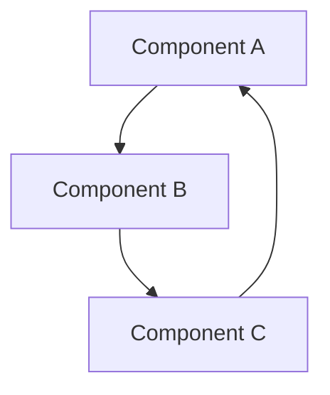

### 4.5 — `TPL-model-note.md`

`````markdown
---
type: model
uid: <% tp.date.now("YYYYMMDDHHmmss") %>
created: <% tp.date.now("YYYY-MM-DD") %>
modified: <% tp.date.now("YYYY-MM-DD") %>
version: 1
tags: [model]
status: draft
---

# <% tp.file.title %>

## Thesis

<!-- What does this model claim or represent? One declarative paragraph. -->


## Components

<!-- Link to the permanent notes that constitute this model. Annotate each. -->
1. [[]] —
2. [[]] —
3. [[]] —

## Relationships

<!-- Describe how the components relate to each other. -->


## Diagram

<!-- ASCII diagram, Mermaid block, or link to visual in _system/media/. -->



## Boundary Conditions

<!-- Where does this model break down? What are its limits? -->


## Version History

| Version | Date | Change |
|---------|------|--------|
| v1 | <% tp.date.now("YYYY-MM-DD") %> | Initial declaration |

---
*Status: draft — not yet stabilized*
`````
