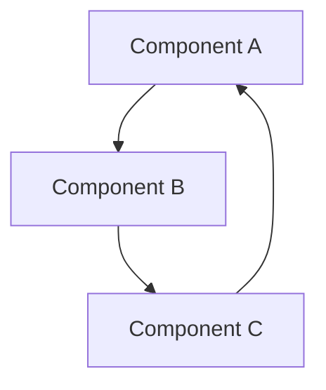

#
Zettelkasten Modeling Vault — Proto Setup

> **Operator-grade reference document.**
> Contains the complete folder structure, all protocol files, all template files, and starter content needed to initialize the vault in a single session.

---

## 1 — Operator Notes

### Purpose

This document contains the full proto setup for a Zettelkasten Modeling Vault built on Obsidian. Every file is reproduced in full — copy-paste ready. One document, one session, vault operational.

### Prerequisites

- Obsidian installed
- Community plugins enabled
- Recommended plugins: Templater, Dataview, Calendar, Periodic Notes, Tag Wrangler

### First-Session Checklist

1. Create the vault folder (`modeling-vault/`)
2. Create the folder tree (Section 2)
3. Create each protocol file in `_protocols/` (Section 3)
4. Create each template file in `_templates/` (Section 4)
5. Create starter content in `00-Hub/` (Section 5)
6. Set Obsidian template folder to `_templates/`
7. Install recommended plugins
8. Run a first ingestion pass using PROTO-ingestion

---

## 2 — Folder Tree

```
modeling-vault/
├── 00-Hub/
│   ├── Dashboard.md
│   ├── Inbox.md
│   └── Changelog.md
├── 01-Zettel/
│   ├── permanent/
│   ├── literature/
│   └── fleeting/
├── 02-Models/
│   ├── active/
│   └── archive/
├── 03-MOC/
├── 04-Sources/
│   ├── references/
│   └── citations/
├── 05-Projects/
│   ├── active/
│   └── archive/
├── 06-Archive/
├── _protocols/
├── _templates/
└── _system/
    ├── media/
    └── config/
```

### Folder Descriptions

| Folder | Purpose |
|--------|---------|
| `00-Hub/` | Central navigation — dashboard, inbox, changelog |
| `01-Zettel/permanent/` | Atomic permanent notes — one idea per note |
| `01-Zettel/literature/` | Source-processing notes — summaries and extractions |
| `01-Zettel/fleeting/` | Quick captures — promote within 7 days or delete |
| `02-Models/active/` | Live model definition notes |
| `02-Models/archive/` | Superseded or retired models |
| `03-MOC/` | Maps of Content — index notes that curate zettel clusters |
| `04-Sources/references/` | Bibliographic source metadata |
| `04-Sources/citations/` | Extracted passages and citation notes |
| `05-Projects/active/` | Live project working notes |
| `05-Projects/archive/` | Completed or abandoned projects |
| `06-Archive/` | General archive for notes removed from active rotation |
| `_protocols/` | Vault governance — naming, linking, review, ingestion, modeling, archival |
| `_templates/` | Obsidian templates for all note types |
| `_system/media/` | Images, diagrams, and media assets |
| `_system/config/` | Vault configuration files |

---

## 3 — Protocol Files

All protocol files live in `_protocols/`.

---

### 3.1 — `PROTO-naming.md`

````markdown
---
type: protocol
id: PROTO-naming
status: active
created: {{date}}
---

# Naming Protocol

## Purpose

Establishes deterministic naming conventions for all note types in the vault.

## Conventions

### Permanent Notes

- Format: `YYYYMMDDHHMMSS — Title`
- Example: `20260426082400 — Atomicity as structural constraint`
- The timestamp prefix is the unique identifier (UID). Use creation time.
- Title is a concise declarative statement of the note's single idea.

### Literature Notes

- Format: `LIT — Author (Year) — Short Title`
- Example: `LIT — Luhmann (1981) — Communication with Slip Boxes`

### Fleeting Notes

- Format: `FL — YYYYMMDD — keyword`
- Example: `FL — 20260426 — linking heuristic idea`
- Fleeting notes are disposable. Promote to permanent or delete within 7 days.

### Model Notes

- Format: `MOD — Model Name — vN`
- Example: `MOD — Triadic Feedback Loop — v1`
- Version number increments on structural revision. Minor edits do not bump version.

### MOC (Map of Content)

- Format: `MOC — Domain or Cluster Name`
- Example: `MOC — Network Dynamics`

### Source Notes

- Format: `SRC — Author (Year)`
- Example: `SRC — Ahrens (2017)`

### Project Notes

- Format: `PROJ — Project Name`
- Example: `PROJ — Vault Proto Setup`

### Daily Notes

- Format: `YYYY-MM-DD`
- Example: `2026-04-26`

## Rules

1. No special characters in filenames except hyphens and em dashes (—).
2. Use title case for titles.
3. UIDs are immutable once created.
4. Aliases may be added in YAML frontmatter for search convenience.
````

---

### 3.2 — `PROTO-linking.md`

````markdown
---
type: protocol
id: PROTO-linking
status: active
created: {{date}}
---

# Linking Protocol

## Purpose

Defines how notes connect to each other. Linking is the structural backbone of the vault.

## Link Types

### Direct Links

- Use `[[wikilinks]]` for all internal references.
- Every permanent note must link to at least one other permanent note.
- Link to the idea, not the source. Source links go in the metadata section.

### Backlinks

- Obsidian generates these automatically. Review backlinks during periodic review.
- Unexpected backlinks are discovery signals — investigate them.

### MOC Links

- Every permanent note should appear in at least one MOC.
- MOCs link downward to zettel. Zettel do not need to link upward to MOCs.

### Model Links

- Model notes link to the permanent notes that constitute their components.
- Use a dedicated `## Components` section in model notes for structural links.

### Source Links

- Literature notes link to their source note (SRC-prefixed).
- Permanent notes derived from literature notes link back to the literature note in their `## Lineage` section.

## Conventions

1. Prefer `[[note title]]` over `[[note title|alias]]` unless the alias is substantially clearer.
2. Use block references (`^blockid`) sparingly — only for precise claims.
3. Embed (`![[note]]`) only in MOCs and dashboards, never in permanent notes.
4. Tag links with context: "This connects because..." — naked links without context are prohibited.

## Link Density Targets

- Permanent notes: 2–5 outgoing links
- Literature notes: 1–3 outgoing links (to permanent notes derived from it)
- Model notes: 3–10 component links
- MOCs: 5–30 curated links
````

---

### 3.3 — `PROTO-review.md`

````markdown
---
type: protocol
id: PROTO-review
status: active
created: {{date}}
---

# Review Protocol

## Purpose

Defines the cadence and criteria for vault maintenance and note quality assurance.

## Review Cadences

### Daily (5 min)

- Process Inbox: promote, link, or delete all inbox items.
- Review fleeting notes older than 3 days: promote to permanent or delete.

### Weekly (20 min)

- Review 10 random permanent notes (use Dataview random query).
- Check for orphan notes (no incoming or outgoing links). Link or archive.
- Update one MOC with any new permanent notes from the week.

### Monthly (45 min)

- Audit tag consistency. Merge or rename stale tags.
- Review model notes: are active models still accurate? Archive superseded models.
- Update Changelog with structural changes.
- Review link density: flag permanent notes with zero outgoing links.

### Quarterly (90 min)

- Full vault health check: orphans, broken links, stale fleeting notes.
- Evaluate folder structure: any folders empty or overloaded?
- Review and update protocols if workflow has evolved.
- Archive completed projects.

## Quality Criteria for Permanent Notes

- [ ] Contains exactly one atomic idea
- [ ] Has a declarative title (states the idea, not the topic)
- [ ] Links to at least one other permanent note
- [ ] Appears in at least one MOC
- [ ] Has complete YAML frontmatter
- [ ] Lineage section traces origin (literature note, observation, synthesis)
````

---

### 3.4 — `PROTO-ingestion.md`

````markdown
---
type: protocol
id: PROTO-ingestion
status: active
created: {{date}}
---

# Ingestion Protocol

## Purpose

Defines the process for bringing new material into the vault.

## Ingestion Pipeline

### Stage 1 — Capture

- New material enters through the Inbox (`00-Hub/Inbox.md`).
- Acceptable inputs: article links, book passages, podcast timestamps, raw ideas, conversation fragments.
- Use fleeting note template for quick captures. Tag with `#inbox`.

### Stage 2 — Process

- For each inbox item, determine the type:
  - Source material → Create a Source Note (SRC) + Literature Note (LIT)
  - Raw idea → Create a Fleeting Note, then evaluate for promotion
  - Reference data → File in `04-Sources/references/`

### Stage 3 — Extract

- From each literature note, extract atomic ideas.
- Each atomic idea becomes one permanent note.
- Write the idea in your own words. Do not copy-paste source text.
- Link the permanent note back to the literature note in the Lineage section.

### Stage 4 — Integrate

- Link the new permanent note to existing permanent notes.
- Add it to the appropriate MOC.
- Check: does this note suggest a new model or modify an existing one?

### Stage 5 — Clean

- Remove the item from Inbox.
- Delete or archive the fleeting note if it was fully promoted.
- Update Changelog if structural changes occurred.

## Rules

1. Never let the Inbox exceed 20 items. Process before adding more.
2. Ingestion is not archiving. Every ingested item must produce at least one permanent note or be explicitly discarded.
3. Batch ingestion sessions: 30-minute blocks, 5–10 items per session.
````

---

### 3.5 — `PROTO-modeling.md`

````markdown
---
type: protocol
id: PROTO-modeling
status: active
created: {{date}}
---

# Modeling Protocol

## Purpose

Defines how to create, evolve, and retire model notes — the vault's primary intellectual output.

## What is a Model Note?

A model note captures a structured representation of a concept, framework, system, or pattern. It is composed of permanent notes (components) and describes their relationships.

## Model Lifecycle

### 1. Emergence

- A model emerges when 3+ permanent notes cluster around a shared pattern.
- Signal: you find yourself linking the same set of notes repeatedly, or a MOC begins to develop internal structure.

### 2. Declaration

- Create a model note using the MOD template.
- Name it: `MOD — Model Name — v1`
- Declare its components (links to permanent notes).
- Write a concise thesis statement: what does this model claim or represent?

### 3. Development

- Add, remove, or reorder components as understanding deepens.
- Minor edits (wording, link additions) do not bump the version.
- Structural revisions (new components, changed relationships, revised thesis) create a new version: copy → rename with v2 → archive v1.

### 4. Stabilization

- A model stabilizes when its components and thesis have not changed for 30+ days.
- Mark status as `stable` in frontmatter.
- Stable models can be referenced by other models and by project notes.

### 5. Retirement

- When a model is superseded or invalidated, move it to `02-Models/archive/`.
- Add a `## Superseded By` section linking to the replacement model.
- Never delete a model — archive it.

## Model Quality Criteria

- [ ] Has a clear, falsifiable thesis statement
- [ ] Components are linked permanent notes (not inline text)
- [ ] Relationships between components are described
- [ ] Version history is maintained
- [ ] Status field is current (draft / active / stable / archived)
````

---

### 3.6 — `PROTO-archival.md`

````markdown
---
type: protocol
id: PROTO-archival
status: active
created: {{date}}
---

# Archival Protocol

## Purpose

Defines when and how notes are moved out of active rotation.

## Archival Triggers

1. A fleeting note has not been promoted within 14 days.
2. A permanent note has zero links (orphan) after two consecutive review cycles.
3. A model note has been superseded by a newer version.
4. A project is completed or abandoned.
5. A source is no longer relevant to any active model or project.

## Archival Process

1. Move the note to the appropriate archive folder:
   - General notes → `06-Archive/`
   - Model notes → `02-Models/archive/`
   - Project notes → `05-Projects/archive/`
2. Add `archived: YYYY-MM-DD` to the YAML frontmatter.
3. Add a brief archival reason in a `## Archived` section at the bottom of the note.
4. Do NOT delete links in other notes that point to the archived note. Obsidian handles broken links gracefully, and the link history is informative.

## Retrieval

- Archived notes can be reactivated at any time by moving them back to their active folder and removing the `archived` field from frontmatter.
- During quarterly review, scan archives for notes that may be relevant to new work.

## Rules

1. Never delete notes. Archive them.
2. Archival is reversible. Deletion is not.
3. Archive is not a junk drawer — every archived note should have an archival reason.
````

---

## 4 — Template Files

All template files live in `_templates/`. Templates use Templater syntax.

---

### 4.1 — `TPL-permanent-note.md`

````markdown
---
type: permanent
uid: <% tp.date.now("YYYYMMDDHHmmss") %>
created: <% tp.date.now("YYYY-MM-DD") %>
modified: <% tp.date.now("YYYY-MM-DD") %>
tags: []
aliases: []
status: draft
---

# <% tp.file.title %>

## Claim

<!-- State the single atomic idea as a declarative sentence. -->


## Development

<!-- Develop the idea. Use your own words. 3–8 sentences. -->


## Lineage

<!-- Where did this idea come from? Link to literature note, conversation, observation. -->
- Source:
- Derived from:

## Links

<!-- Connect to other permanent notes. Annotate each link with context. -->
-

---
*Reviewed: never*
````

---

### 4.2 — `TPL-literature-note.md`

````markdown
---
type: literature
uid: <% tp.date.now("YYYYMMDDHHmmss") %>
created: <% tp.date.now("YYYY-MM-DD") %>
modified: <% tp.date.now("YYYY-MM-DD") %>
source: "[[]]"
tags: [literature]
status: processing
---

# <% tp.file.title %>

## Summary

<!-- 3–5 sentence summary of the source in your own words. -->


## Key Ideas

<!-- List the main ideas. Each may become a permanent note. -->
1.
2.
3.

## Extracted Notes

<!-- Link to permanent notes created from this literature note. -->
-

## Quotes

<!-- Verbatim quotes with page numbers. Use sparingly. -->
>

## Assessment

<!-- Your evaluation: what's valuable, what's weak, what's missing? -->

````

---

### 4.3 — `TPL-fleeting-note.md`

````markdown
---
type: fleeting
created: <% tp.date.now("YYYY-MM-DD") %>
tags: [inbox]
promote-by: <% tp.date.now("YYYY-MM-DD", 7) %>
---

# <% tp.file.title %>

<!-- Capture the idea quickly. Don't worry about structure. -->
<!-- You have 7 days to promote this to a permanent note or delete it. -->

````

---

### 4.4 — `TPL-moc.md`

````markdown
---
type: moc
created: <% tp.date.now("YYYY-MM-DD") %>
modified: <% tp.date.now("YYYY-MM-DD") %>
tags: [moc]
status: active
---

# <% tp.file.title %>

## Overview

<!-- What domain or cluster does this MOC cover? 2–3 sentences. -->


## Core Notes

<!-- Curated list of permanent notes in this domain. Group by sub-theme. -->

### Sub-theme A
-

### Sub-theme B
-

## Models

<!-- Link to model notes that draw from this cluster. -->
-

## Open Questions

<!-- What's unresolved? What needs more zettel? -->
-

---
*Last curated: <% tp.date.now("YYYY-MM-DD") %>*
````

---

### 4.5 — `TPL-model-note.md`

`````markdown
---
type: model
uid: <% tp.date.now("YYYYMMDDHHmmss") %>
created: <% tp.date.now("YYYY-MM-DD") %>
modified: <% tp.date.now("YYYY-MM-DD") %>
version: 1
tags: [model]
status: draft
---

# <% tp.file.title %>

## Thesis

<!-- What does this model claim or represent? One declarative paragraph. -->


## Components

<!-- Link to the permanent notes that constitute this model. Annotate each. -->
1. [[]] —
2. [[]] —
3. [[]] —

## Relationships

<!-- Describe how the components relate to each other. -->


## Diagram

<!-- ASCII diagram, Mermaid block, or link to visual in _system/media/. -->



## Boundary Conditions

<!-- Where does this model break down? What are its limits? -->


## Version History

| Version | Date | Change |
|---------|------|--------|
| v1 | <% tp.date.now("YYYY-MM-DD") %> | Initial declaration |

---
*Status: draft — not yet stabilized*
`````

---

### 4.6 — `TPL-project-note.md`

````markdown
---
type: project
created: <% tp.date.now("YYYY-MM-DD") %>
modified: <% tp.date.now("YYYY-MM-DD") %>
tags: [project]
status: active
deadline:
---

# <% tp.file.title %>

## Objective

<!-- What is this project trying to accomplish? -->


## Deliverables

- [ ]
- [ ]
- [ ]

## Related Notes

<!-- Link to permanent notes, models, and MOCs relevant to this project. -->
-

## Log

<!-- Append dated entries as work progresses. -->
### <% tp.date.now("YYYY-MM-DD") %>
-
````

---

### 4.7 — `TPL-source-note.md`

````markdown
---
type: source
created: <% tp.date.now("YYYY-MM-DD") %>
author:
year:
title: ""
publisher:
tags: [source]
citekey:
---

# <% tp.file.title %>

## Bibliographic Data

- **Author:**
- **Year:**
- **Title:**
- **Publisher/Journal:**
- **DOI/URL:**

## Literature Notes

<!-- Link to literature notes that process this source. -->
-

## Status

- [ ] Read
- [ ] Processed (literature note created)
- [ ] Extracted (permanent notes created)
````

---

### 4.8 — `TPL-daily-note.md`

````markdown
---
type: daily
created: <% tp.date.now("YYYY-MM-DD") %>
tags: [daily]
---

# <% tp.date.now("YYYY-MM-DD, dddd") %>

## Focus

<!-- What are you working on today? -->
-

## Notes

<!-- Capture thoughts, observations, tasks. -->
-

## Ingestion

<!-- What did you ingest today? Link to new literature or fleeting notes. -->
-

## Links Created

<!-- What new connections did you make? -->
-

---
*End of day review: [ ] Inbox processed | [ ] Fleeting notes checked*
````

---

## 5 — Starter Content

These files live in `00-Hub/`.

---

### 5.1 — `Dashboard.md`

`````markdown
---
type: hub
tags: [hub, dashboard]
---

# Vault Dashboard

## Inbox

![[Inbox]]

## Recent Notes

```dataview
TABLE type, status, created
FROM ""
WHERE type != "hub"
SORT created DESC
LIMIT 10
```

## Orphan Notes

```dataview
LIST
FROM "01-Zettel/permanent"
WHERE length(file.outlinks) = 0 AND length(file.inlinks) = 0
```

## Fleeting Notes — Expiring Soon

```dataview
TABLE promote-by AS "Promote By", created
FROM "01-Zettel/fleeting"
WHERE promote-by <= date(today) + dur(3 days)
SORT promote-by ASC
```

## Active Models

```dataview
TABLE version, status, modified
FROM "02-Models/active"
SORT modified DESC
```

## Active Projects

```dataview
TABLE status, deadline, modified
FROM "05-Projects/active"
SORT deadline ASC
```
`````

---

### 5.2 — `Inbox.md`

````markdown
---
type: hub
tags: [hub, inbox]
---

# Inbox

> [!info] Processing Rule
> Keep this list under 20 items. Process daily using PROTO-ingestion.

## Incoming

<!-- Add raw captures here. Move to proper note types during processing. -->
-
````

---

### 5.3 — `Changelog.md`

````markdown
---
type: hub
tags: [hub, changelog]
---

# Vault Changelog

## YYYY-MM-DD — Vault Initialized

- Created folder structure
- Added all protocol files
- Added all template files
- Added starter hub content
- Protocols active: PROTO-naming, PROTO-linking, PROTO-review, PROTO-ingestion, PROTO-modeling, PROTO-archival
````

---

## 6 — Quick Reference Card

### Note Type Reference

| Note Type | Prefix | Folder | Template | Link Target |
|-----------|--------|--------|----------|-------------|
| Permanent | `YYYYMMDDHHMMSS` | `01-Zettel/permanent/` | `TPL-permanent-note` | 2–5 outgoing |
| Literature | `LIT` | `01-Zettel/literature/` | `TPL-literature-note` | 1–3 outgoing |
| Fleeting | `FL` | `01-Zettel/fleeting/` | `TPL-fleeting-note` | 0 (temporary) |
| Model | `MOD` | `02-Models/active/` | `TPL-model-note` | 3–10 components |
| MOC | `MOC` | `03-MOC/` | `TPL-moc` | 5–30 curated |
| Source | `SRC` | `04-Sources/references/` | `TPL-source-note` | 0–1 |
| Project | `PROJ` | `05-Projects/active/` | `TPL-project-note` | variable |
| Daily | `YYYY-MM-DD` | root or daily folder | `TPL-daily-note` | variable |
Protocol Index
### Protocol Index

| Protocol | File | Governs |
|----------|------|---------|
| Naming | `PROTO-naming.md` | File naming conventions for all note types |
| Linking | `PROTO-linking.md` | Link types, density targets, annotation rules |
| Review | `PROTO-review.md` | Daily/weekly/monthly/quarterly review cadences |
| Ingestion | `PROTO-ingestion.md` | Pipeline for bringing new material into vault |
| Modeling | `PROTO-modeling.md` | Model lifecycle: emergence → declaration → stabilization → retirement |
| Archival | `PROTO-archival.md` | When and how to archive notes |

---

*End of proto setup. Vault is ready for initialization.*